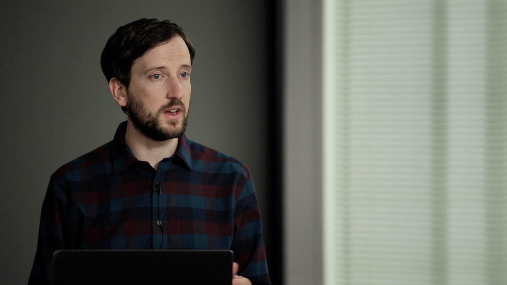

Hello! And welcome to the sixth edition of the Complete Intro to React as taught by [Brian Holt][twitter].

> You _do not_ need to take the previous versions of this course in order to take this one. This is a total revision of the course that we do to keep it fresh.

This course is unique as compared to other React introductions because this course attempts to teach you not only React but the ecosystem around React. When I was learning React myself, I found myself frustrated that it seemed like every tutorial started on step 14 and left out the steps 1-13 of how to set up a React project. React is nearly never used by itself, so it's useful to know the tools you're using. I believe you, as a developer, should know how your tools work and what purpose they're serving. Many times have I taught courses similar to this one to hear people using tools and complaining about them because they don't actually know why they're using them, just that they're necessary. As such, in this course, we show you how to build projects without using any tools at all and introduce the various tools one at a time, so you understand the actual problem being solved by the tool. Hopefully, given the knowledge of the problem solved by the tool, you'll embrace the tools despite their complexities due to the ease and power they offer you.

## Who is this course for

You, hopefully. 😄 This course is for anyone who wants to know React better. The course assumes only a basic knowledge of JavaScript ([start here if you need help with that][bootcamp]). This course will equally be useful for people learning React for the first time as it is for people who have written some React but want to understand the tools better. If you have taken previous versions of this course, this course will feature current versions (as of writing) of all the libraries and update on all the new features that have since come out. This class will share much of the structure of v5 since I was really happy with how that course's narrative worked.

## Set up

This course works and has been tested on both macOS and Windows 10. It also will work very well on Linux (just follow the macOS instructions). You shouldn't need a particularly powerful computer for any part of this course. 8GB of RAM would more than get you through it and you can definitely get away with less.

- Install Node.js. Make sure your version of Node.js is at least 12, preferably the latest stable release. I prefer using nvm to install Node.js, [see setup instructions here][nvm].
- While you do not have to use [Visual Studio Code][vsc], it is what I will be using and I'll be giving you fun tips for it along the way. I am on the VS Code team so I'm a bit biased!
- People often ask me what my coding set up is so let's go over that really quick!
  - Font: [Dank Mono][dank]. Be sure to [enable ligatures][ligatures] in VS Code! If you want ligatures without Dank, check out Microsoft's [Cascadia Code][cascadia].
  - Theme: I actually just like Dark+, the default VS Code theme. Though I do love [Sarah Drasner's Night Owl][night-owl] too.
  - Terminal: I just switched back to using macOS's built in terminal. [iTerm2][iterm] is great too. On Windows I love [Windows Terminal][terminal].
  - VS Code Icons: the [vscode-icons][icons] extension.

## Where to File Issues

I write these courses and take care to not make mistakes. However when teaching over ten hours of material, mistakes are inevitable, both here in the grammar and in the course with the material. However I (and the wonderful team at Frontend Masters) are constantly correcting the mistakes so that those of you that come later get the best product possible. If you find a mistake we'd love to fix it. The best way to do this is to [open a pull request or file an issue on the GitHub repo][issues]. While I'm always happy to chat and give advice on social media, I can't be tech support for everyone. And if you file it on GitHub, those who come later can Google the same answer you got.

## Who am I

My name is Brian Holt and I am a principal program manager at Microsoft. I mostly work on Azure, trying to make it the place you want to deploy your JavaScript code. I also get to work on the Visual Studio Code and TypeScript teams and help make those tools to make you more productive. I've been at Microsoft for about four years as of the writing of this course. Before becoming a PM at Microsoft, I worked in developer relations as well as a frontend and Node.js engineer at LinkedIn, Netflix, Reddit, and a couple of other smaller companies.

I have been working with React for a long time. [Here's my tweet][tweet] from when I launched Reddit's first instance of React.js from 2014. It's been an invaluable tool for me and one of the few tools that I have been happy to use for nearly seven years now. I'm a big fan and I'm hoping I can show you what makes me so happy to continue to use React.

When I'm not working or developing new Frontend Masters courses, you'll find me in Seattle, WA. I love to travel, get out of breath on my Peloton, play Dota 2 and Overwatch poorly, as well as drink Islay Scotches, local IPAs and medium-roast coffees.

Catch up with me on social media! I'll be honest: I'm not great at responding at DMs. The best way to talk to me is just to tweet at me.

- [Twitter][twitter]
- [LinkedIn][linkedin]
- [GitHub][github]

And one last request! [Please star this repo][site]. It helps the course be more discoverable and with my fragile ego.

## How the repo works

There are two repos for this class: [the website you're currently on][site] and [the example projects][projects].

Every step of this project will have a folder that will be a snapshot of where the project is at that step. If you get stuck, want to copy/paste some long bit of code you don't feel like writing, or just want to walk through the code at that point, please do! The primary goal of this is for you to learn so as long as you're learning there's no cheating!

The naming format will be `step-XX-<name of the lesson>` so you can get a rough idea of order and which lesson the step is coming from. In each snapshot you'll have to run `npm install` again since it'll literally just be another whole copy of the project.

[twitter]: https://twitter.come/holtbt
[bootcamp]: https://frontendmasters.com/bootcamp/
[nvm]: https://github.com/nvm-sh/nvm
[vsc]: https://code.visualstudio.com/
[dank]: https://gumroad.com/l/dank-mono
[ligatures]: https://worldofzero.com/posts/enable-font-ligatures-vscode/
[night-owl]: https://marketplace.visualstudio.com/items?itemName=sdras.night-owl
[cascadia]: https://github.com/microsoft/cascadia-code
[terminal]: https://www.microsoft.com/en-us/p/windows-terminal/9n0dx20hk701?activetab=pivot:overviewtab
[icons]: https://marketplace.visualstudio.com/items?itemName=vscode-icons-team.vscode-icons
[iterm]: https://iterm2.com/
[issues]: https://github.com/btholt/complete-intro-to-react-v6/issues
[github]: https://github.com/btholt
[linkedin]: https://www.linkedin.com/in/btholt/
[gh]: https://btholt.github.io/complete-intro-to-react-v6/
[projects]: https://github.com/btholt/citr-v6-project
[site]: https://github.com/btholt/complete-intro-to-react-v6
